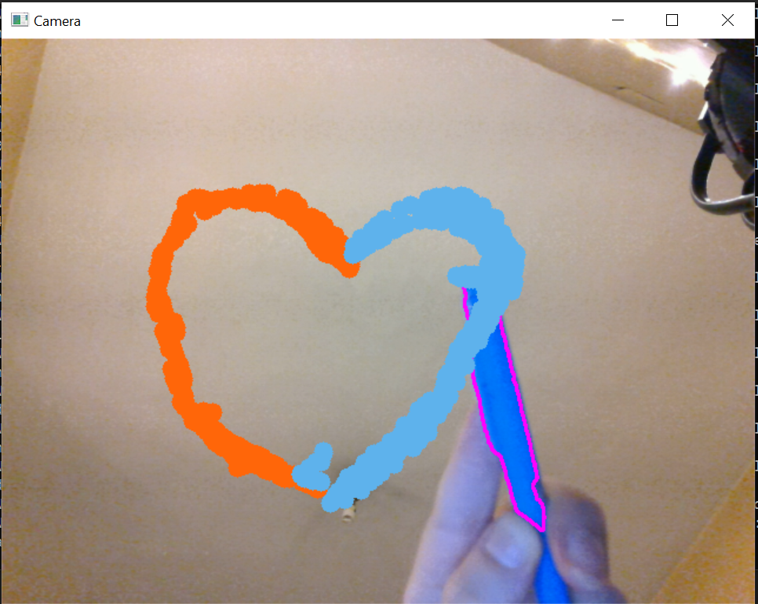

# Real-Time Color-Based Drawing with OpenCV

This project demonstrates how to detect specific colors in real-time using a webcam feed and draw on the screen at the locations where the colors are found. The program doesn't perform color detection for user inputs, but instead detects predefined color ranges and draws circles at the detected points.

## Features

- **Real-Time Color Detection**: Uses the webcam feed to detect predefined colors.
- **Automatic Drawing**: The program draws circles on the screen at the locations where the predefined colors are detected.
- **Customizable Colors**: The colors used for detection and drawing are defined using HSV values and BGR values, respectively. These can be modified in the code to track different colors or adjust drawing styles.
- **Color Adjustment with Picker**: You can use the included color picker tool to fine-tune the HSV values for better detection.

## Requirements

- OpenCV library installed.
- A C++ compiler.
- A working webcam.

## Installation

1. Clone the repository:
   ```bash
   git clone https://github.com/yourusername/color-drawing-opencv.git
   cd color-drawing-opencv

## Adjusting the Colors

If you want to adjust the HSV ranges to detect different colors, you can use the **Color Picker Tool** provided in this repository: [Color Picker Project](https://github.com/YagmurTaze/Color-Picker). The tool allows you to fine-tune the HSV values for different colors and then use those values in this drawing application.

## Results



